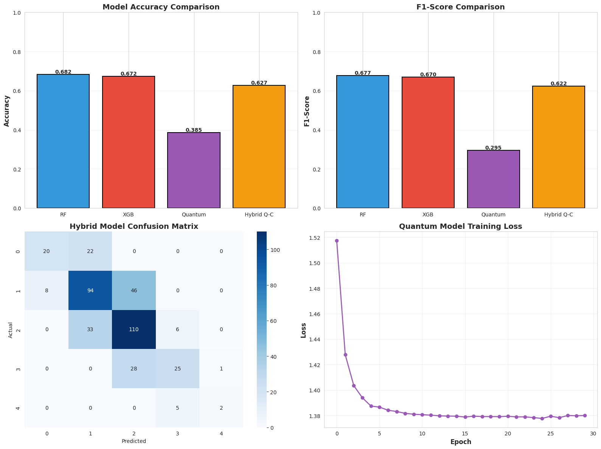
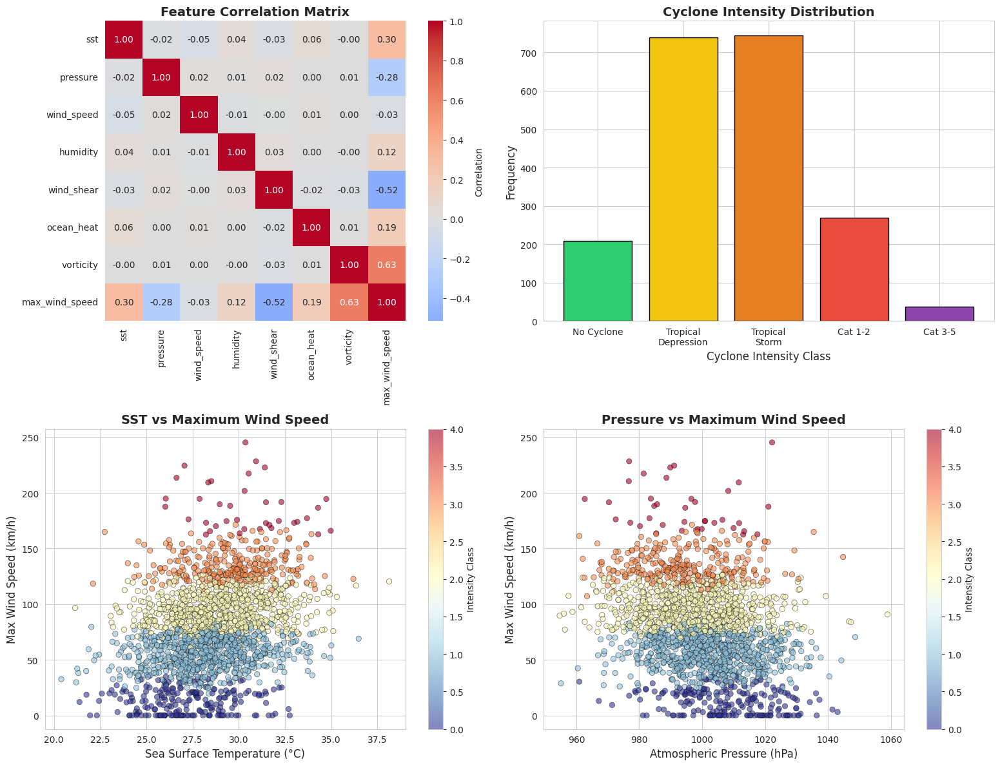

# Quantum-Classical Hybrid Cyclone Prediction Model 

This repository contains a reproducible demo that explores how hybrid quantum–classical models can be applied to cyclone prediction tasks.
# Author : Jaisimha Manipatruni 

**Key components**
- Synthetic yet physically-inspired dataset generator.
- Classical baselines: Random Forest, RBF-SVM, MLP.
- Classical encoder (autoencoder-like MLP) to produce low-dimensional latents.
- Quantum Kernel SVM implemented with PennyLane (simulator).
- Optional Variational Quantum Classifier (VQC) hybrid.
- Evaluation: Accuracy, ROC-AUC, calibration, bootstrap significance tests.

> This project is intended as a research/demo pipeline. It uses simulators (`default.qubit`) for the quantum components. To test on hardware you must adapt backends and implement shot-based kernel estimation/noise mitigation.
> 

  
  
   <em>Figure : Comparison between classical and quantum-enhanced models</em>

  
  
   <em>Figure :Weather Visual Models</em>

